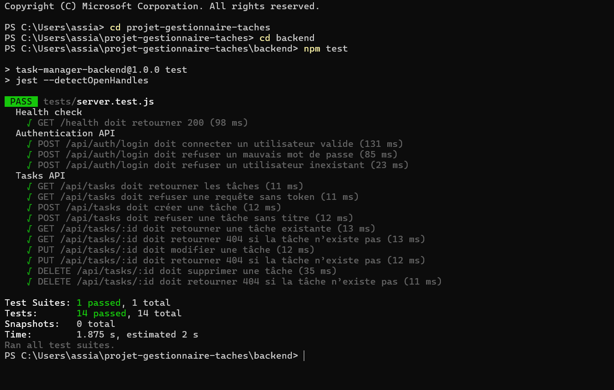
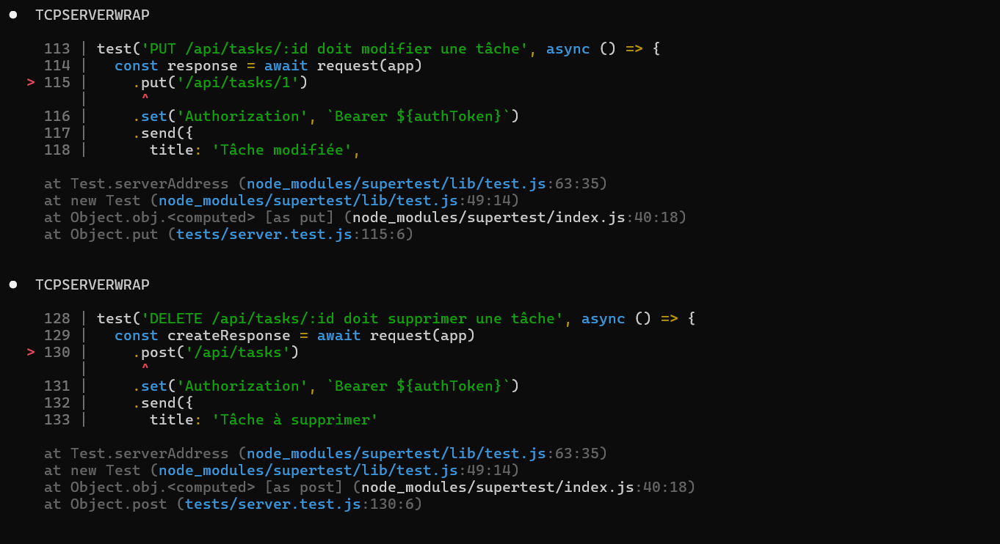

# Projet-gestionnaire-taches

Application web de gestion collaborative de tâches, développée en suivant la méthodologie GitHub Flow, l'automatisation CI/CD et la conteneurisation Docker.

## Organisation de l'Équipe et Rôles

| Membre | Rôle principal | Tâches réalisées |
| :--- | :--- | :--- |
| **Assia MAKHLOUFI** | QA & Test Engineer | Inspection du code (React/Express), création du fichier `backend/tests/server.test.js`, installation de Jest, implémentation des tests d'intégration API (`/health`, `/api/auth/login`). |
| **Aya BOUCHAIR** | DevOps & Integrator | Initialisation du dépôt Git, configuration du workflow CI/CD GitHub Actions (`.github/workflows/ci.yml`), gestion des branches/merge, ajout de `docker-compose.yml`. |
| **Nadine ZERGUINE** | Lead Infrastructure | Configuration ESLint, règles de protection de branche, revue des Pull Requests (PR) et documentation. |

---

## Structure du Projet

```text
projet-gestionnaire-taches/
├── backend/
│   ├── server.js
│   ├── package.json
│   └── tests/
│       └── server.test.js     
├── frontend/
│   ├── src/                    
│   ├── package.json
│   └── vite.config.js
├── .github/
│   └── workflows/
│       └── ci.yml              
├── docker-compose.yml         
└── README.md                   

```
## Historique d'Exécution et Analyse du Travail
### Étape 1 : Implémentation et Validation des Tests (Assia)

Assia a configuré les tests serveur backend pour valider les endpoints d'authentification et de santé de l'API :

    Création du dossier et fichier de test : backend/tests/server.test.js.

    Installation des dépendances via npm install pour résoudre l'absence initiale du module jest.

    Validation de la suite de tests Jest :

        GET /health (Code HTTP 200)

        POST /api/auth/login (connexion valide, mot de passe erroné, utilisateur inexistant).

  
 

### Étape 2 : Configuration du Workflow et CI/CD (Aya)

Aya a mis en place la structure globale du dépôt et l'automatisation sur GitHub :

    Initialisation de la branche develop et ajout des dossiers .gitkeep.

    Création de la branche feature/ci-cd-setup pour écrire le workflow .github/workflows/ci.yml.

    Push du workflow et ouverture de la Pull Request #6.

    Ajustement du pipeline CI pour exécuter la commande npm test --if-present afin d'éviter le blocage du pipeline en l'absence de scripts.

    Intégration de la conteneurisation docker-compose.yml et fusion (merge) sur la branche main.


Difficultés Rencontrées et Solutions Apportées

    Erreur touch non reconnue sous Windows CMD :

        Problème : La commande touch n'existe pas par défaut dans le shell Windows CMD.

        Solution : Utilisation de la commande type nul > file pour générer les fichiers .gitkeep.

    Commande jest ou npm non trouvée dans le terminal :

        Problème : Tentative d'exécution de npm test avant le téléchargement des paquets (jest: command not found).

        Solution : Exécution préalable de npm install dans le répertoire backend.

    Échec des status checks lors du merge de la PR :

        Problème : Le pipeline CI bloquait la fusion sur main en raison de scripts manquants côté frontend.

        Solution : Ajout du flag --if-present dans le fichier ci.yml pour que les jobs réussissent dynamiquement si les scripts de tests sont définis.

CI/CD (GitHub Actions) & Docker
Intégration Continue

Le fichier .github/workflows/ci.yml automatise :

    L'installation des dépendances Node.js (v20) pour le frontend et le backend.

    L'exécution automatique des tests d'intégration à chaque PR soumise sur main.

## Conteneurisation Docker (Bonus)

Un fichier docker-compose.yml est disponible à la racine du projet :
Bash
```
docker-compose up --build
```
### Instructions d'Exécution Locale
Backend
Bash
```
cd backend
npm install
npm run dev
```
Frontend
Bash
```
cd frontend
npm install
npm start
```

---

## Points Bonus & Innovation

### 1. Conteneurisation Docker
L'application a été entièrement conteneurisée pour garantir un environnement d'exécution uniforme entre le développement et la production :
- **`docker-compose.yml` :** Orchestration en une seule commande du serveur Express (`backend`) et de l'interface React (`frontend`).
- **Isolation :** Gestion autonome des ports et des variables d'environnement.

---

### 2. Perspectives d'évolution 

Bien que le temps imparti ait été concentré sur la mise en place de la chaîne DevOps, de la CI/CD et des tests d'API, voici les fonctionnalités prévues pour les prochaines itérations :

#### Améliorations UX/UI
- **Tableau Kanban interactif :** Glisser-déposer (Drag & Drop) des cartes de tâches entre les colonnes (*À faire*, *En cours*, *Terminé*).
- **Mode Sombre (Dark Mode) :** Prise en compte des préférences système de l'utilisateur.

#### Fonctionnalités Métier & Monitoring
- **Système de Notifications :** Alerte en temps réel lors de l'assignation d'une tâche ou de l'approche d'une date limite.
- **Tableau de bord Analytics :** Métriques visuelles sur la productivité de l'équipe et le taux de résolution des tickets.
- **Monitoring CI/CD :** Intégration d'outils de suivi comme Prometheus/Grafana pour surveiller le taux de réussite des builds et les performances serveur.

   
